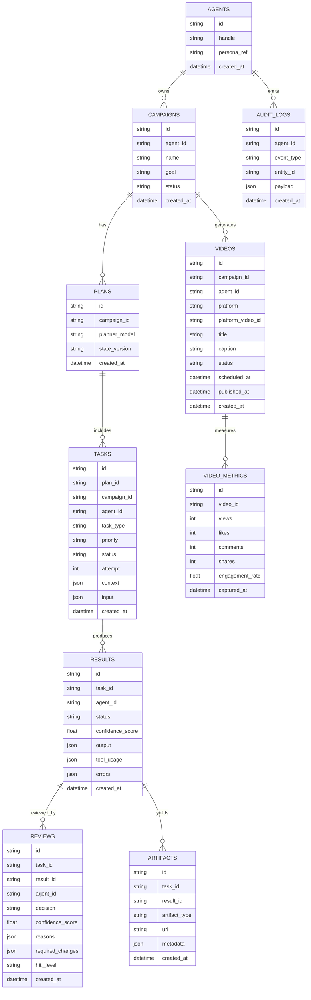

# Project Chimera — Technical Specification

This document defines the technical contracts, schemas, and data model for Project Chimera. It is the authoritative source of truth for agent communication, persistence, governance, and execution constraints.

---

## 1. System Topology

### 1.1 Logical Services

#### Planner Service

* Decomposes high-level intent into ordered Tasks
* Publishes Tasks to `task_queue`

#### Worker Pool

* Stateless workers consuming from `task_queue`
* Uses MCP Resources and MCP Tools exclusively
* Publishes Results to `review_queue`

#### Judge Service

* Consumes Results from `review_queue`
* Produces ReviewDecision objects
* Commits approved state to persistence
* Escalates when required

#### Human Review (HITL)

* Consumes escalated items from `hitl_queue`
* Human decisions override agent decisions
* All actions are auditable

---

## 2. Non-Negotiable Constraints

1. All external access MUST occur via MCP
2. Direct external API calls are forbidden
3. All inter-service communication MUST be schema-compliant
4. All actions MUST be attributable and auditable
5. Sensitive actions MUST escalate to humans

---

## 3. Queue Contracts (Redis)

### 3.1 Queues

* `task_queue` — Planner → Worker
* `review_queue` — Worker → Judge
* `hitl_queue` — Judge → Human
* `planner_queue` — Judge → Planner (optional)

### 3.2 Encoding Rules

* UTF-8 JSON
* One message per object
* Trace metadata required on all messages

---

## 4. Core Schemas

### 4.1 Task (Planner → Worker)

```json
{
  "task_id": "uuid",
  "task_type": "trend_fetch | generate_caption | generate_image | generate_video | schedule_post | reply_comment | classify_comments | execute_transaction",
  "priority": "high | medium | low",
  "agent_id": "agent_<uuid>",
  "campaign_id": "uuid",
  "created_at": "ISO-8601",
  "due_at": "ISO-8601",
  "status": "pending | in_progress | review | complete | failed",
  "context": {
    "goal_description": "string",
    "persona_constraints": ["string"],
    "required_resources": ["mcp://..."],
    "acceptance_criteria": ["string"]
  },
  "input": {
    "params": {}
  },
  "trace": {
    "plan_id": "uuid",
    "parent_task_id": "uuid | null",
    "attempt": 1
  }
}

```

### 4.2 Result (Worker → Judge)

```json
{
  "result_id": "uuid",
  "task_id": "uuid",
  "agent_id": "agent_<uuid>",
  "created_at": "ISO-8601",
  "status": "success | error",
  "confidence_score": 0.0,
  "output": {
    "artifacts": [
      {
        "artifact_type": "text | image | video | metadata | transaction_proposal",
        "uri": "string",
        "content": "string | null",
        "metadata": {}
      }
    ],
    "summary": "string"
  },
  "tool_usage": [
    {
      "tool_name": "string",
      "server_name": "string",
      "purpose": "string",
      "success": true
    }
  ],
  "errors": [
    {
      "code": "string",
      "message": "string",
      "retryable": true
    }
  ],
  "trace": {
    "plan_id": "uuid",
    "parent_task_id": "uuid | null",
    "attempt": 1
  }
}

```

### 4.3 ReviewDecision (Judge Output)

```json
{
  "review_id": "uuid",
  "task_id": "uuid",
  "result_id": "uuid",
  "agent_id": "agent_<uuid>",
  "created_at": "ISO-8601",
  "decision": "approve | reject | escalate",
  "confidence_score": 0.0,
  "reasons": ["string"],
  "required_changes": ["string"],
  "escalation": {
    "required": false,
    "reason": "string | null",
    "hitl_level": "async_review | mandatory_review | blocked"
  },
  "state_commit": {
    "required": true,
    "state_version_expected": "string",
    "state_version_new": "string | null"
  }
}

```

### 4.4 Trend Snapshot Artifact

```json
{
  "trend_snapshot_id": "uuid",
  "agent_id": "agent_<uuid>",
  "captured_at": "ISO-8601",
  "source": "mcp_resource",
  "items": [
    {
      "topic": "string",
      "score": 0.0,
      "region": "string | null",
      "language": "string | null",
      "evidence": [
        {
          "resource_uri": "mcp://...",
          "excerpt": "string"
        }
      ]
    }
  ]
}

```

---

## 5. HITL Policy

* Confidence > 0.90 → auto-approve
* 0.70–0.90 → async human review
* < 0.70 → reject and retry
* Sensitive domains always escalate

---

## 6. Persistence Model

* **PostgreSQL:** tasks, results, reviews, artifacts, audit logs, video metadata
* **Redis:** queues and transient execution state
* **Vector DB:** out of scope

---

## 7. ERD



---

## 8. Concurrency Control

* Plans maintain a `state_version`
* Workers operate on snapshots
* Judge commits only on version match
* Mismatch triggers replan

---

## 9. Definition of Done

* Schemas are stable and enforceable
* ERD matches schemas
* Queue semantics are explicit
* MCP and governance constraints are enforced

---

## 10. Data Retention Policies

### 10.1 PostgreSQL Tables

* `AUDIT_LOGS`: 90 days (archive to cold storage after)
* `VIDEO_METRICS`: 30 days of detailed data, 1 year aggregated
* `TASKS/RESULTS/REVIEWS`: 180 days for completed tasks
* `ARTIFACTS`: 30 days for large binary data

### 10.2 Redis Data

* **Queues:** 7 days maximum retention
* **Ephemeral state:** 24 hours TTL
* **Rate limit counters:** 1 hour sliding window

---

## 11. Monitoring & Observability

### 11.1 Required Metrics

* **Queue lengths:** `task_queue`, `review_queue`, `hitl_queue`
* **Processing latency:** Per task type
* **Agent health:** Uptime and health status
* **External Integration:** MCP tool success/failure rates
* **Governance:** Confidence score distributions

### 11.2 Alerting Thresholds

* **Queue length > 1000:** Warning
* **Worker failure rate > 5%:** Critical
* **HITL escalation rate > 20%:** Warning
* **Planner decomposition failures:** Immediate

---

## 12. Deployment Specifications

### 12.1 Service Scaling

* **Planner:** 1-3 instances (CPU-bound)
* **Worker Pool:** 5-50 instances (auto-scale based on queue depth)
* **Judge:** 2-5 instances (high availability)
* **Redis:** 3-node cluster with persistence
* **PostgreSQL:** Primary + 2 read replicas

### 12.2 Resource Requirements

| Service | CPU | Memory | Storage | Network |
| --- | --- | --- | --- | --- |
| **Planner** | 2-4 vCPU | 4-8 GB | 10 GB | Medium |
| **Worker** | 4-8 vCPU | 8-16 GB | 50 GB* | High |
| **Judge** | 1-2 vCPU | 2-4 GB | 10 GB | Low |

**Workers may need GPU for video generation*

---

## 13. Disaster Recovery

### 13.1 Backup Strategy

* **PostgreSQL:** Hourly incremental + daily full backups
* **Redis:** RDB snapshots every 15 minutes
* **Artifact Storage:** Versioned S3/GCS buckets
* **Configuration:** Git-versioned, encrypted secrets

### 13.2 Recovery Procedures

1. **Database corruption:** Restore from latest backup (RTO: 15min)
2. **Queue data loss:** Replay from task persistence (RTO: 30min)
3. **Worker swarm failure:** Auto-restart with state recovery
4. **Region failure:** Failover to secondary region (RTO: 5min)

---

## 14. Security Specifications

### 14.1 Data Classification

* **P1 (Sensitive):** API keys, credentials, transaction data
* **P2 (Confidential):** Campaign strategies, agent personas
* **P3 (Internal):** Task specifications, results
* **P4 (Public):** Published content, aggregated metrics

### 14.2 Encryption Requirements

* **Data at rest:** AES-256 encryption
* **Data in transit:** TLS 1.3+
* **Secrets:** Vault or KMS managed
* **Database:** Transparent Data Encryption (TDE)

### 14.3 Access Controls

* **Agents:** Least privilege service accounts
* **Humans:** RBAC with MFA requirement
* **API:** Rate limiting + API key rotation

---

## 15. Testing Strategy

### 15.1 Contract Testing

* JSON schema validation on all queue messages
* API version compatibility checks
* Database migration rollback tests

### 15.2 Integration Testing

* End-to-end task lifecycle validation
* MCP server availability and response testing
* Failure scenario simulations

### 15.3 Performance Testing

* **Load:** 1000 concurrent tasks
* **Stress:** 5000+ queue backlog
* **Soak:** 72-hour continuous operation

---

## 16. Development Guidelines

### 16.1 Code Standards

* **All schemas:** JSON Schema + TypeScript definitions
* **Database:** Migration scripts for every change
* **APIs:** OpenAPI 3.0 specification
* **Error handling:** Structured errors with codes

### 16.2 Operational Runbooks

* **Runbook 1:** Queue backlog handling
* **Runbook 2:** Worker scaling procedures
* **Runbook 3:** HITL escalation management
* **Runbook 4:** Data recovery procedures

---

## 17. Cost Management

### 17.1 Expected Costs (Monthly)

* **Compute:** $500-2000 (scales with usage)
* **Database:** $300-800
* **Storage:** $200-500 (video artifacts)
* **MCP API calls:** Variable based on platforms

### 17.2 Optimization Strategies

* Worker auto-scaling based on time of day
* Video quality tiering (resolution vs. cost)
* Cache frequently accessed MCP resources
* Archive old data to cheaper storage